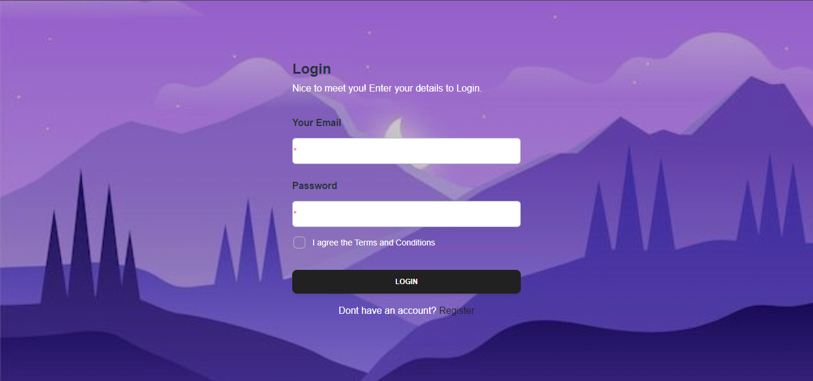
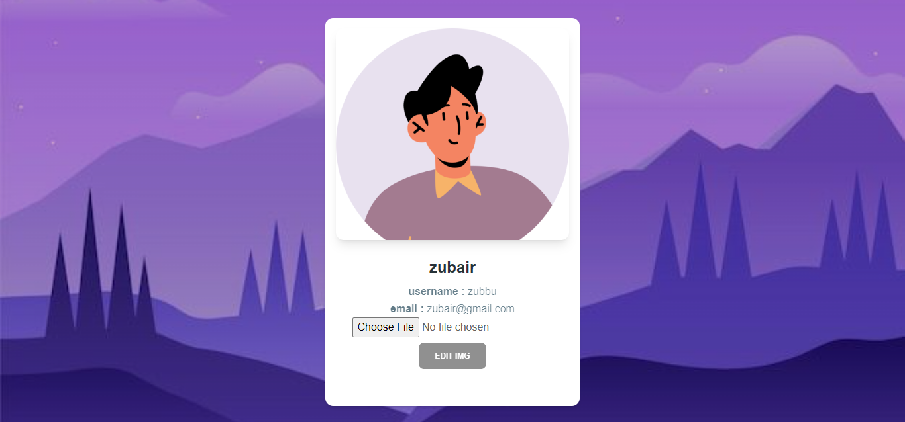
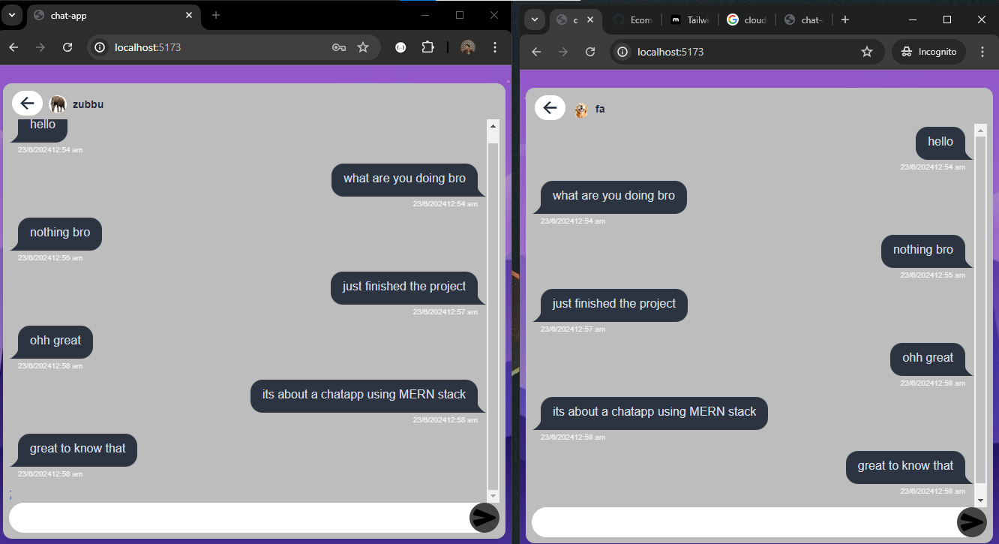

# MERN Chat App with Socket.io

## 1. How to Install and Run the App

### Prerequisites

- Node.js
- MongoDB
- socket.io

### Installation

1. Clone the repository:

   ```bash
   git clone https://github.com/ali432003/mern-chatt-app.git
   cd humantek-TASK-chatApp
   ```
2. Create a `.env` file in the backend directory with the following content:
    ```env
    PORT=5000
    MONGODB_CONNECT=your_mongodb_uri
    JWT_SECRET=your_jwt_secret
    SECURE="development"
    CLOUDINARY_CLOUD_NAME=your_cloudinary_cloud_name
    CLOUDINARY_API_KEY=your_cloudinary_api_key
    CLOUDINARY_API_SECRET=your_cloudinary_api_secret
    ```   
   

3. Install dependencies for both the frontend and backend:

   - Frontend:

     ```bash
     cd frontend
     npm install
     ```

   - Backend:
     ```bash
     cd ../backend
     npm install
     ```

### Running the App

1. Start the backend server:

   ```bash
   cd backend
   npm run dev
   ```
2. Open your cmd/powershell and checks `Running at http://localhost:5000`
   `DB connected Succesfully` 

3. Start the frontend development server:

   ```bash
   cd ../frontend
   npm run dev
   ```

4. Open your browser and navigate to `http://localhost:5173`

## 2. Technologies Used

### Frontend

```json
"dependencies": {
    "@material-tailwind/react": "^2.1.9",
    "axios": "^1.6.7",
    "chattapp-com": "file:..",
    "react": "^18.2.0",
    "react-dom": "^18.2.0",
    "react-icons": "^5.0.1",
    "react-router-dom": "^6.22.2",
    "react-toastify": "^10.0.4",
    "socket.io-client": "^4.7.4",
    "zustand": "^4.5.2"
}
```

### Backend

```json
"dependencies": {
    "bcryptjs": "^2.4.3",
    "cloudinary": "^2.2.0",
    "cookie-parser": "^1.4.6",
    "cors": "^2.8.5",
    "dotenv": "^16.4.5",
    "express": "^4.18.3",
    "jsonwebtoken": "^9.0.2",
    "mongodb": "^6.4.0",
    "mongoose": "^8.2.0",
    "multer": "^1.4.5-lts.1",
    "nodemon": "^3.1.0",
    "path": "^0.12.7",
    "socket.io": "^4.7.4"
}
```

## 2. Snapshots





## 4. Managed and Produced by

```markdown
GitHub Username: [ali432003](https://github.com/ali432003)

